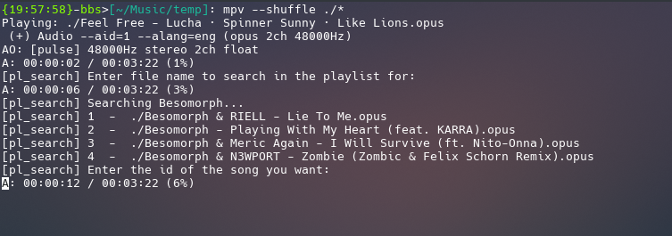
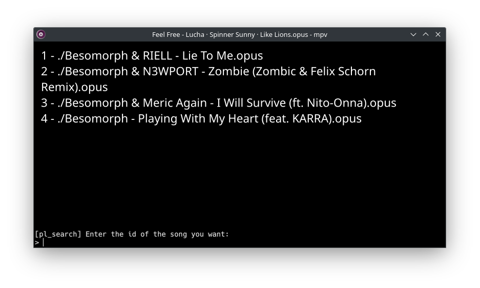

## MPV Playlist Search Plugin

With this script you can search through your big playlists and jump right to the files you want.

## Installation

You first need to install [mpv-user-input](https://github.com/CogentRedTester/mpv-user-input?tab=readme-ov-file#installation) and then you can put `pl-search.lua` to your "scripts" folder.

## Usage

Default shortcut is `Ctrl+f`.

It first asks you for a file name to search for in the current playlist. If there are more than one match, it then asks for which of the matches you want to play.

Can be used with both the CLI:

and the GUI:

## Issues

It works with playlist files like `.m3u` or `.m3u8` but it doesn't work when you feed mpv something like `./music/*`

To aid with that problem, you can use this shell script that makes a playlist from the contents of current folder:

``for f in ./!(*.m3u8); do echo "$f" >> ${PWD##*/}.m3u8; done``
